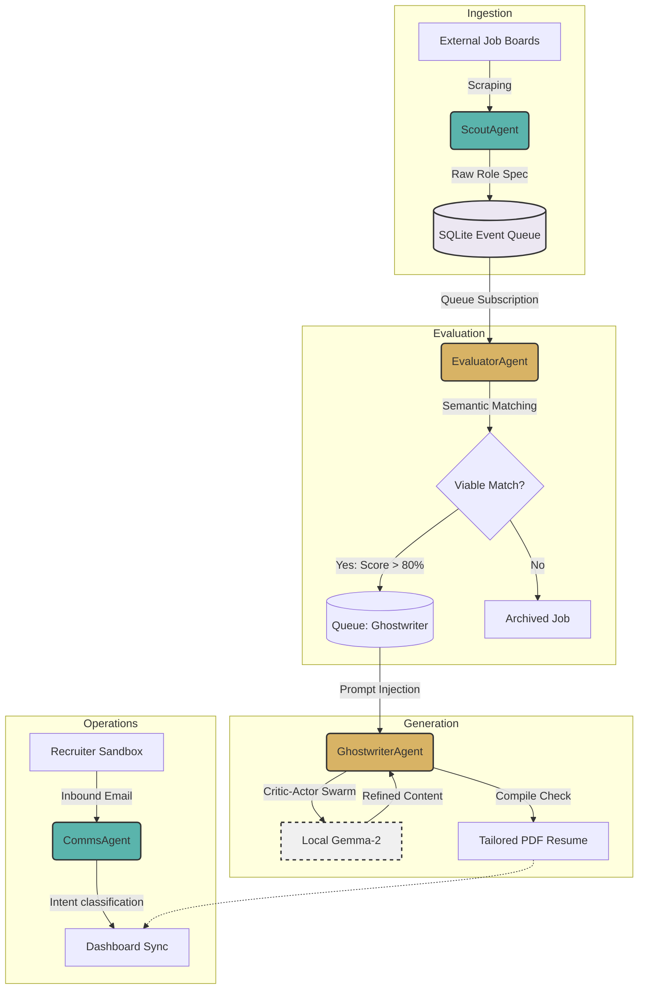
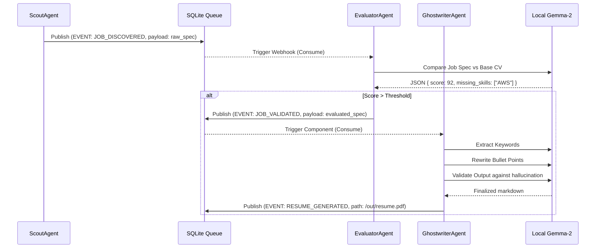

# 🚀 J-JobHunterAI Enterprise

<div align="center">
  <h3>An enterprise-grade, autonomous Multi-Agent Swarm designed to automate, optimize, and secure the modern job hunting pipeline.</h3>
  <p>J-JobHunterAI goes beyond simple scraping. It is a highly scalable, event-driven multi-agent ecosystem engineered to autonomously discover, process, evaluate, and track job applications with strict data sovereignty.</p>
</div>

---

## 🌟 Enterprise Value Proposition

In the competitive landscape of talent acquisition and placement, efficiency and privacy are paramount. J-JobHunterAI provides:

- **Data Sovereignty:** Completely enclosed infrastructure. All proprietary data, PII, and credentials reside on your local hardware or self-hosted servers. Nothing is transmitted to centralized cloud or external telemetry services without explicit configuration.
- **Autonomous Swarm Intelligence:** Replaces manual application workflows by utilizing an interconnected, self-correcting swarm of advanced local AI agents.
- **High Throughput Processing:** Designed around a resilient, localized event queue, enabling the parallel execution of job extraction, evaluation, and documentation generation.

## 🏗 Swarm Architecture & Diagrams

The core of J-JobHunterAI features specialized autonomous agents operating asynchronously over a localized event-driven pipeline. 

### High-Level Topology



### Agent Behaviors
- 🕵️ **ScoutAgent (Extraction Node):** Autonomously monitors target markets (e.g., tech and remote job platforms), extracts highly-structured role specifications, and securely funnels raw ingestion data into the persistent swarm queue.
- 🧠 **EvaluatorAgent (Semantic Matchmaker):** Intercepts raw job ingestion and executes deep-semantic, multidimensional scoring against localized engineering profiles, determining precise role-to-candidate viability.
- 📝 **GhostwriterAgent (Local Gemma Orchestrator):** A sophisticated multi-level Critic-Actor swarm utilizing local `gemma-2`. Employs narrow-chaining where a "Miner" extracts constraints, a "Writer" iteratively redesigns resume data, and a stringent "Supervisor" validates outputs—guaranteeing zero AI hallucinations before generating pixel-perfect PDF assets.
- 📨 **CommsAgent (Workflow Operations):** Natively monitors inbound communication vectors, automatically parsing recruiter intents (interview invitations, rejections) and syncing updates to the master enterprise dashboard in real-time.

### Event Processing Sequence



## ⚙️ Example Configs & Sample Workflow

A primary benefit of the J-JobHunterAI enterprise architecture is that everything operates on fully-typed JSON constraints. 

### 1. Base Profile Ingestion (Your Resume Data)
You provide a JSON detailing your core experience. This is what the `GhostwriterAgent` draws from.
```json
{
  "profile_id": "eng_lead_01",
  "base_title": "Senior Solutions Engineer",
  "experience": [
    {
      "company": "Enterprise Tech Corp",
      "bullets": [
        "Led a team of 5 engineers to migrate legacy REST to GraphQL.",
        "Reduced query latency by 45% using Redis caching."
      ]
    }
  ]
}
```

### 2. Job Discovered via ScoutAgent
The `ScoutAgent` finds a role calling for heavy Python and performance optimization. It drops this into the Queue:
```json
{
  "job_id": "stripe_099",
  "company": "Stripe",
  "role": "Backend Performance Engineer",
  "requirements": ["Python", "Caching methodologies", "Leadership"]
}
```

### 3. Generated Tailored PDF Output
The `GhostwriterAgent` intercepts the payload, runs a sequence of "Mining" and "Writing" loops, and outputs a freshly tailored bullet point optimized strictly for Stripe:
> **Output:** "Led cross-functional team of 5 engineers to modernize infrastructure, integrating distributed caching methodologies (Redis) that slashed data-retrieval latency by 45%, fulfilling stringent performance SLAs."


## 🛠 Enterprise Tech Stack

Built for maximum performance, determinism, and maintainability:

- **Core Engine:** Node.js, TypeScript, unified monorepo workspace structure.
- **Data Persistence:** Prisma ORM, highly optimized Custom SQLite implementations for state management and local event sourcing.
- **Control Plane:** React, Vite-powered glassmorphic interface built on Radix primitives.
- **AI Infrastructure:** Natively integrated with **Ollama** allowing fully local deployment of `gemma2:2b` for maximum privacy and low latency, backed by OpenRouter/OpenAI compatibility layers for scalable hybrid configurations.

## 🚀 Deployment Guide

1. **Clone the Repository:**
   ```bash
   git clone https://github.com/akash-rathod01/JobHunterAI.git
   cd J-JobHunterAI
   ```
2. **Install Workspace Dependencies:**
   ```bash
   npm install
   ```
3. **Provision the Local AI Engine (Recommended for Absolute Privacy):**
   ```bash
   ollama run gemma2:2b
   ```
4. **Initialize the Control Plane (Dashboard):**
   ```bash
   npm run dev:all
   ```

> 🌐 The enterprise control plane will initialize and become available on `http://localhost:5173`, providing real-time telemetry into agent swarms and generated collateral.

*Note: Production-grade CI via GitHub actions and `dev` scripts are configured.*

## 🧪 Testing & Validation

Enterprise pipelines require rigorous testing paradigms. J-JobHunterAI enforces deterministic operation via:
- **Unit Testing:** Validates Queue states, rate limiters, and telemetry parsers.
- **Integration Testing:** Tests End-to-End ingestion flows mocking LLM outputs using structured JSON schemas.
- **Continuous Integration:** Fully automated `biome` linting and TypeScript checks via GitHub Actions.

## 🔒 Security, Privacy & Self-Hosting

J-JobHunterAI adheres to strict operability and privacy defaults. Your data (emails, resumes, profiles, API keys, credentials) is completely segregated and inherently yours. The system uses local SQLite persistence, guaranteeing the absence of vendor lock-in, external SaaS database dependencies, and unauthorized telemetry tracking.

## 📝 Licensing & Contribution

This platform is proudly open-source and distributed under the **AGPLv3 License**. Enterprise teams are free to modify, extend agent logic, and formulate custom event loops.

---

<div align="center">
  <b>Architected & Maintained by <a href="https://github.com/akash-rathod01">Akash Rathod</a></b>
</div>
